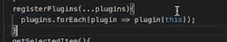

1. 轮播图组件的优化

   - 插件化
     简化构造函数 => 依赖注入 => 功能插件化
     

   ```js
   // 类似于vue插件的设计 plugin.install里可以接受轮播图实例 (plugin是一个函数或者一个带有install方法的对象)
   use(plugin,options) {
      plugin.install(this,options)
   }
   ```

   - 模板化：
     插件使用接口模板化
     相同逻辑封装模板化方法
     例如挂载图片的 render 函数

   - 抽象化：
     使用抽象基类模板化生命周期

2. 纯函数的好处
   - 无副作用、可预期
   - 容易测试
