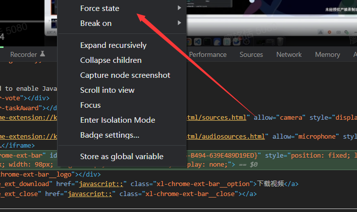
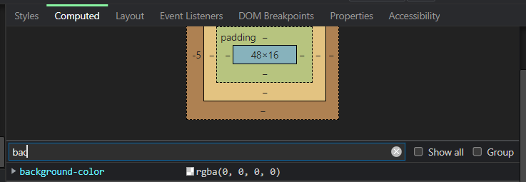
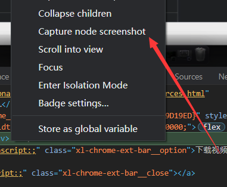
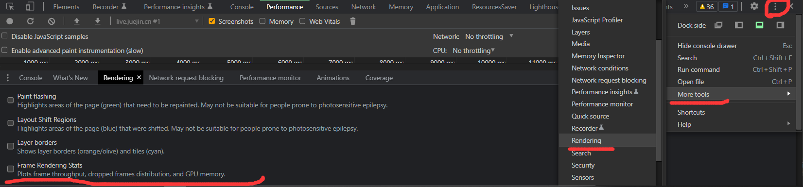
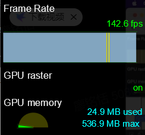
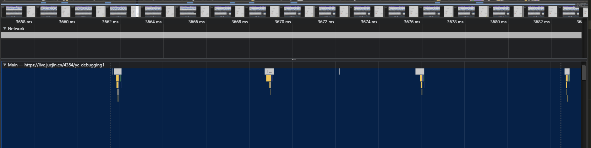
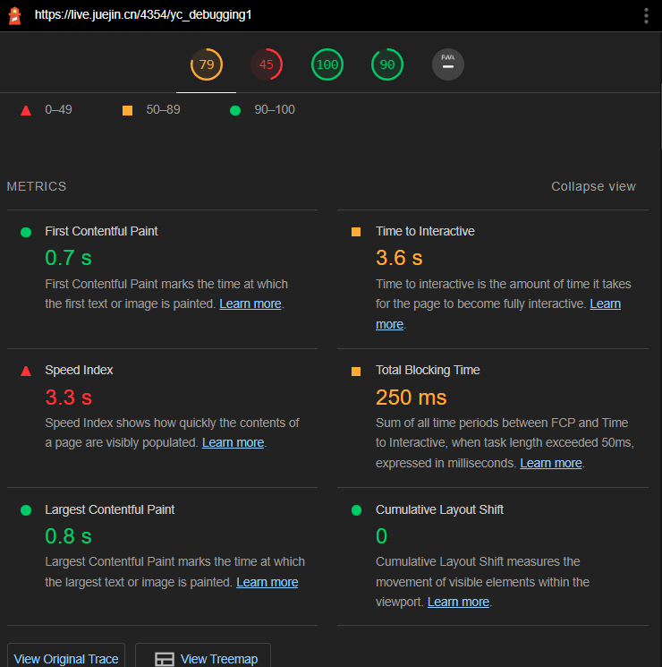

## Elements

1. 动态修改样式
2. 让伪类生效 force state
   
3. 过滤查找想要调试的样式 computed filter
   
4. 截屏网页 capture node screenshot
   

## Console

5. console 占位符给日志添加信息
   `console.table` 打印二维数组/JSON
   `console.dir(root,{depth:null})` 递归打印树结构

## Sources

6. source tab 断点调试
   使用关键字 `debugger` 或代码预览区域的行号可以设置断点
   执行到断点处时代码暂停执行
   展开 Breakpoints 列表可以查看断点列表，勾选/取消可以激活/禁用对应断点
   暂停状态下，鼠标 hover 变量书可以查看变量的值
   在调试器 Watch 右侧点击＋可以添加对变量的监控，查看该变量的值

7. 思考题:既然 Source Map 可以映射源码，那压缩后的代码带上 Source Map 上线不就又不安全了吗?
   规范：`把 dist 里的 sourecemap 上传到监控平台，上线的时候把 dist 里的 sourcemap 删除`
   mappings 字段存储了源文件和 Souroe Map 的映射
   - 英文，表示源码及压缩代码的位置关联
   - 逗号，分隔一行代码中的内容。
   - 分号，代表换行。

## Network

## Application

## Performance

页面卡顿 => 查看 FPS 指标 => 寻找性能瓶颈

- FPS 查看
  
- fps 低于 60 就会出现卡顿
  
- 分析性能瓶颈
  

## Lighthouse

因为 Performance 过于复杂 所以我们可以使用 Lighthouse 来检测性能
核心 Web 指标
LCP(最大内容绘制 应<2.5s)
FID(首次输入延迟 应<100ms)
CLS(累积布局偏移 应<0.1)

## Tips

- 线上即时修改 ovverides (现在用热更新 这个用的少了)

  1.  打开 Sources 面板下的的 Overrides
  2.  点击 Select folders for ovverides。选择一个本地的空文件夹目录。
  3.  允许授权
  4.  在 page 中修改代码，修改完成后 command +s 保存
  5.  打开 devTools ，点击右上角的三个小点>More tools ->Changes，就能看到所有修改了

- 跨域正向代理
